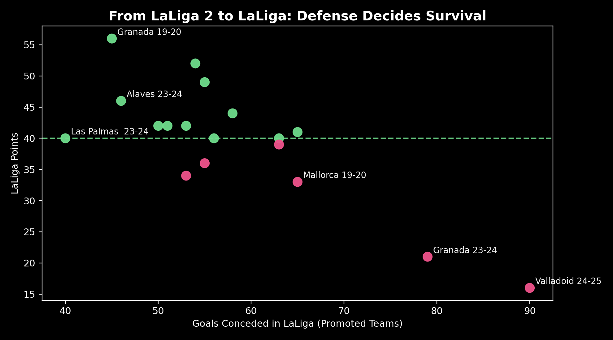
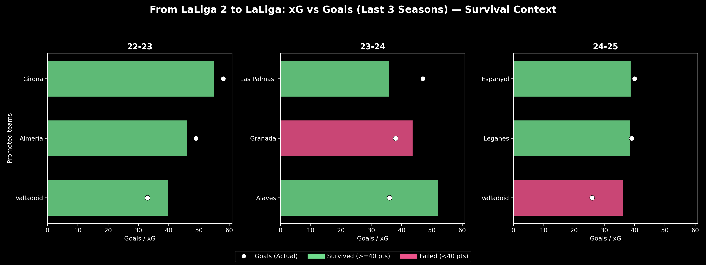
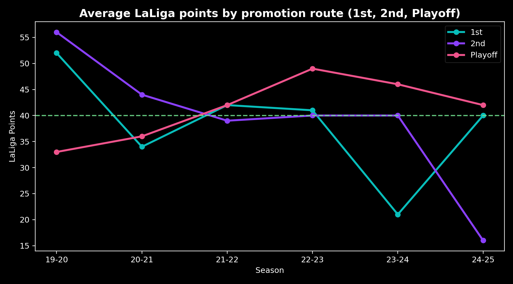
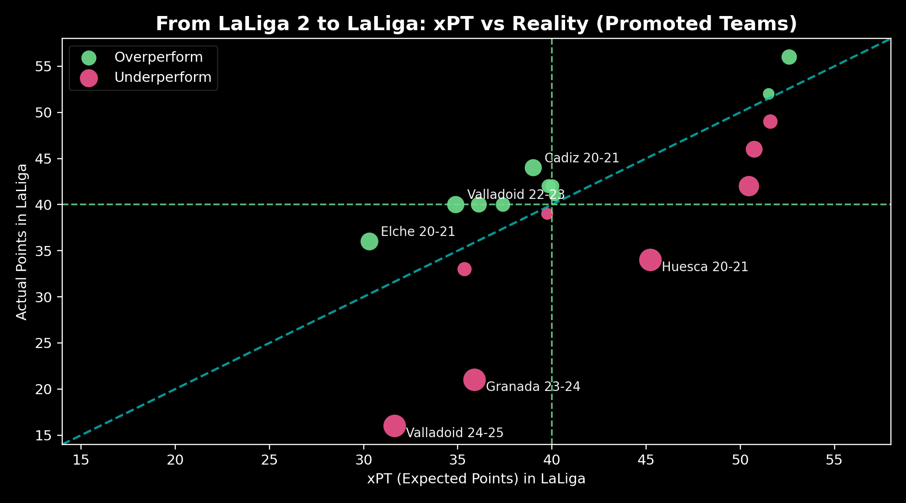
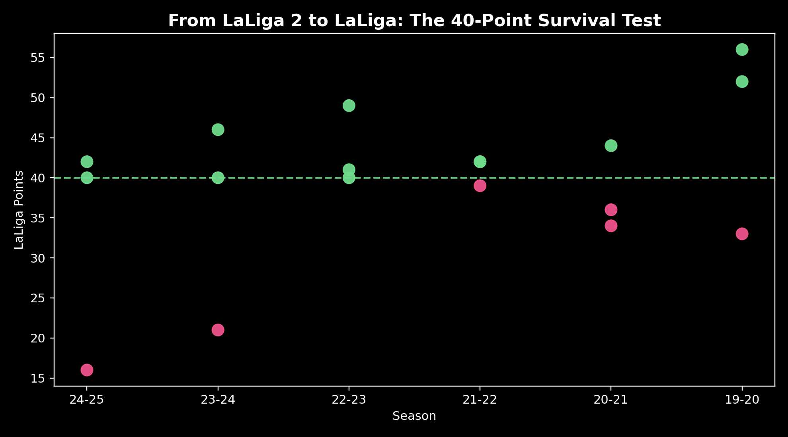

# From LaLiga 2 to LaLiga: What Decides Survival?

Every season, three teams earn promotion from **LaLiga 2** to **LaLiga**.  
What happens next is far less discussed.

This project analyzes promoted teams across recent seasons to understand **what actually determines survival in LaLiga** — beyond hype, promotion rank, or single-season narratives.

---

## Motivation

Promotion earns you a place in LaLiga.  
**Survival is earned again.**

Most promoted teams struggle immediately. This project looks at *why* — using performance, expected metrics, and outcomes to identify the real survival patterns.

---

## Data

- Team-level data for **promoted clubs**
- Metrics include:
  - Points
  - Goals scored & conceded
  - Expected goals (xG)
  - Expected points (xPT)
- Focused on recent LaLiga seasons

> Data is aggregated and used for analytical illustration.

---

## Key Questions

- Does promotion rank (1st / 2nd / Playoff) matter?
- Is survival driven by performance or margins?
- How important is defensive solidity?
- Can finishing outperforming xG compensate for structural weakness?
- Is the 40-point rule still valid?

---

## Key Findings

- **Defense is non-negotiable**  
  Promoted teams that concede heavily almost never survive.

- **Promotion rank offers no protection**  
  Dominating LaLiga 2 does not guarantee LaLiga safety.

- **Margins decide survival**  
  Overperforming expected points (xPT) often separates survivors from relegated teams.

- **Finishing under pressure matters**  
  Teams that match or exceed their xG are more likely to stay up.

- **40 points remains the survival benchmark**  
  Most promoted teams fail to reach it.

---

## Visual Analysis

### Defense Decides Survival


### xG vs Goals (Last 3 Seasons)


### Promotion Route vs LaLiga Points


### xPT vs Reality


### The 40-Point Survival Test


---

## How to Run

```bash
pip install -r requirements.txt
python laliga_segunda.py
python chances_goals.py
